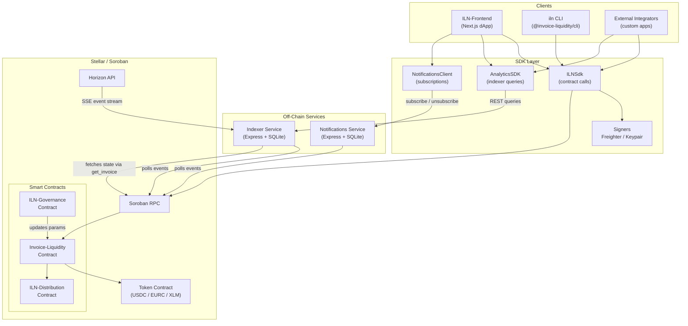

# ILN Architecture

## Three-Repo Structure

ILN is split across three GitHub repositories, each with a distinct responsibility:

| Repository | Description | Language |
|---|---|---|
| [Invoice-Liquidity-Network](https://github.com/Invoice-Liquidity-Network/Invoice-Liquidity-Network) | Org root — SDK, CLI, indexer, notifications service, docs | TypeScript |
| [ILN-Frontend](https://github.com/Invoice-Liquidity-Network/ILN-Frontend) | Next.js dApp — freelancer dashboard, LP analytics, governance UI | TypeScript |
| [ILN-Smart-Contract](https://github.com/Invoice-Liquidity-Network/ILN-Smart-Contract) | Soroban smart contracts — invoice lifecycle, multi-token, reputation | Rust |

The frontend and smart contract repos are included as git submodules in the org root. The root repo itself is a **pnpm workspace** managed with **Turborepo**, containing all shared tooling packages.

---

## Full System Diagram



---

## Package Structure (Org Root Repo)

```
Invoice-Liquidity-Network/
├── sdk/                    # @invoice-liquidity/sdk
│   └── src/
│       ├── client.ts       # ILNSdk — wraps all contract calls
│       ├── signers.ts      # Freighter (browser) + Keypair (Node) signers
│       ├── analytics.ts    # AnalyticsSDK — indexer REST client with cache
│       ├── notifications.ts# NotificationsClient — subscription management
│       └── types.ts        # Shared TypeScript types
│
├── cli/                    # @invoice-liquidity/cli  (binary: iln)
│   └── src/
│       ├── cli.ts          # Command definitions (submit, fund, pay, status, list)
│       ├── client.ts       # ILNClient wrapping SDK for CLI use
│       └── config.ts       # .iln.json / env var resolution
│
├── indexer/                # iln-indexer (private, deployed to Railway)
│   └── src/
│       ├── api.ts          # Express REST API
│       ├── processor.ts    # Event decode + upsert logic
│       ├── db.ts           # SQLite queries
│       └── rpc.ts          # get_invoice() helper
│
├── notifications/          # iln-notifications (private, deployed separately)
│   └── src/
│       ├── api.ts          # Subscribe / unsubscribe endpoints
│       ├── dispatcher.ts   # Email (Resend) + webhook delivery
│       └── poller.ts       # Event polling loop
│
├── packages/
│   └── indexer/            # @iln/indexer — reusable Horizon indexer utility
│       └── src/
│           ├── indexer.ts  # ILNEventIndexer class (SSE + pagination)
│           └── types.ts    # ContractEvent, IndexerOptions
│
├── examples/
│   └── portfolio-report/   # Example: LP/freelancer analytics script
│
├── tests/e2e/              # End-to-end lifecycle tests (requires local Docker node)
├── scripts/                # deploy.ts, seed.sh, fund-wallets.sh, dev-setup.sh
├── docs/                   # You are here
├── docker-compose.yml      # Local Stellar standalone node
└── pnpm-workspace.yaml     # Workspace manifest
```

---

## How the Components Interact

### Write Path (state-changing transactions)

1. A client (frontend, CLI, or external app) calls an `ILNSdk` method such as `submitInvoice()` or `fundInvoice()`.
2. `ILNSdk` builds a Soroban transaction, simulates it via RPC to get footprint and fee estimates, then asks the configured **signer** to sign the XDR.
3. The signed transaction is submitted to **Soroban RPC**, which executes the contract function on Stellar.
4. The contract emits an event (`submitted`, `funded`, `paid`, or `defaulted`) into the ledger.

Two signers are provided out of the box:

| Signer | Use case |
|---|---|
| `createFreighterSigner()` | Browser — delegates signing to the Freighter wallet extension |
| `createKeypairSigner(secretKey)` | Node.js — signs locally using a Stellar keypair |

### Read Path (state queries)

- **Direct contract reads** use `ILNSdk.getInvoice()`, which simulates a `get_invoice()` call via RPC without submitting a transaction. No signer is required.
- **Analytics reads** use `AnalyticsSDK`, which queries the indexer REST API. The SDK maintains an in-memory cache with a configurable TTL (default 5 minutes) to avoid hammering the indexer.

### Indexer

The indexer is a Node.js service that keeps an off-chain SQLite mirror of on-chain invoice state:

1. Every `POLL_INTERVAL_MS` (default 5 s), it fetches new Soroban events from the RPC using cursor-based pagination.
2. For each new event, it decodes the event type from `topic[0]` and the invoice ID from the event value.
3. It calls `get_invoice(id)` on the RPC to fetch the current authoritative invoice state and upserts it into SQLite.
4. Event IDs are deduplicated so re-processing is safe.

This design means the indexer always holds accurate state even if events arrive out of order or after a ledger re-org.

### Notifications Service

The notifications service watches the same contract events and dispatches alerts to subscribers:

- Supports `email` (via Resend) and `webhook` channels
- Triggers: `invoice_funded`, `invoice_paid`, `invoice_defaulted`, `invoice_due_soon`, `invoice_overdue`
- Rate-limited to 10 notifications per minute per address, with 3 retry attempts on delivery failure

---

## Contract Deployment Model

### Contracts

Three Soroban contracts are deployed, each with a distinct role:

| Contract | Role |
|---|---|
| `Invoice-Liquidity` | Core lifecycle logic — submit, fund, mark_paid, claim_default, get_invoice |
| `ILN-Distribution` | Token distribution helper — called by the core contract on fund and settlement |
| `ILN-Governance` | On-chain parameter governance — manages protocol-level settings |

All contracts are written in Rust and compiled to WASM for deployment on Stellar Soroban.

### Networks

| Network | RPC URL | Status |
|---|---|---|
| Testnet | `https://soroban-testnet.stellar.org` | Deployed |
| Standalone | `http://localhost:8000/soroban/rpc` | Local dev via Docker |
| Mainnet | `https://mainnet.sorobanrpc.com` | Pending audit |

### Deploying a Contract

The `scripts/deploy.ts` script handles the full deployment workflow:

```bash
# Deploy to testnet
npx tsx scripts/deploy.ts

# Deploy to mainnet
npx tsx scripts/deploy.ts --network=mainnet

# Preview without deploying
npx tsx scripts/deploy.ts --dry-run
```

The script runs `stellar contract build`, uploads the resulting WASM, then writes the new contract ID to `.env` and `README.md`.

---

## The SDK's Role

The SDK (`@invoice-liquidity/sdk`) is the primary integration point for any application that needs to interact with ILN. It abstracts three layers of complexity:

1. **Transaction construction.** Soroban transactions require building XDR, simulating for footprint, and handling the prepare/sign/submit/poll cycle. The SDK encapsulates all of this behind simple async methods.

2. **Signer abstraction.** Different environments sign transactions differently — a browser app uses Freighter, a backend script uses a keypair file. The `TransactionSigner` interface makes the SDK environment-agnostic.

3. **Analytics access.** `AnalyticsSDK` wraps the indexer REST API with TypeScript types, `bigint` parsing for large amounts, and a caching layer. Consumers don't need to know the indexer URL or response shape.

The CLI is itself a thin wrapper around the same SDK and serves as a reference implementation for Node.js usage.

---

## Data Flow: Full Invoice Lifecycle

```
┌─────────────┐    submit_invoice()     ┌───────────────────────┐
│  Freelancer │ ──────────────────────► │  Invoice-Liquidity    │
│  (via SDK)  │                         │  Contract             │
└─────────────┘                         │                       │
                                        │  status: Pending      │
                                        │  emits: "submitted"   │
                                        └──────────┬────────────┘
                                                   │ event
                                                   ▼
                                        ┌──────────────────────┐
                                        │  Indexer             │
                                        │  (polls RPC)         │
                                        │  upserts SQLite row  │
                                        └──────────────────────┘

┌─────────────┐    fund_invoice()       ┌───────────────────────┐
│     LP      │ ──────────────────────► │  Invoice-Liquidity    │
│  (via SDK)  │                         │  Contract             │
└─────────────┘                         │                       │
      ▲                                 │  status: Funded       │
      │ USDC escrow                     │  pays freelancer      │
      │ (discount amt)                  │  emits: "funded"      │
      │                                 └───────────────────────┘
      │
      │ USDC payout
      ▼
┌─────────────┐
│  Freelancer │  ← receives amount − discount_amount immediately
└─────────────┘

┌─────────────┐    mark_paid()          ┌───────────────────────┐
│    Payer    │ ──────────────────────► │  Invoice-Liquidity    │
│  (via SDK)  │                         │  Contract             │
└─────────────┘                         │                       │
                                        │  status: Paid         │
                                        │  pays LP (amount +    │
                                        │    discount_amount)   │
                                        │  +1 payer reputation  │
                                        │  emits: "paid"        │
                                        └───────────────────────┘

── OR, if payer misses due date ──────────────────────────────────

┌─────────────┐    claim_default()      ┌───────────────────────┐
│     LP      │ ──────────────────────► │  Invoice-Liquidity    │
│  (via SDK)  │                         │  Contract             │
└─────────────┘                         │                       │
      ▲                                 │  status: Defaulted    │
      │ returns escrowed                │  returns discount to  │
      │ discount_amount only            │  LP only              │
                                        │  −5 payer reputation  │
                                        │  emits: "defaulted"   │
                                        └───────────────────────┘
```

---

## Local Development Setup

A full local environment requires:

- Node.js 18+, pnpm 9+
- Rust + Stellar CLI (for contract builds)
- Docker (for the local Stellar node)

```bash
# Clone with submodules
git clone --recurse-submodules https://github.com/Invoice-Liquidity-Network/Invoice-Liquidity-Network.git
cd Invoice-Liquidity-Network

# Install workspace dependencies
pnpm install

# Start a local Stellar standalone node
docker-compose up -d

# Run E2E tests against the local node
npm run test:e2e
```

See [local-development.md](local-development.md) for a complete walkthrough including contract deployment and test account seeding.
